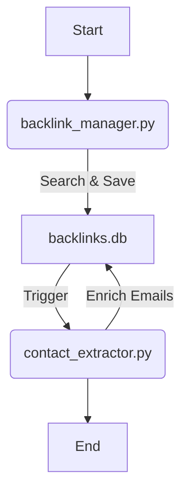

# MVP Walkthrough

I have implemented the **Core Backlink Prospecting MVP** with **SQLite Storage** and **Playwright Email Extraction**.

## 1. Key Features

- **Dynamic Input**: Reads cities from `d:\OutReach\docs\general approach.md`.
- **Cleaner Data**: Extracts "Company Name" from the URL.
- **Email Extraction**: Uses Playwright to visit sites and find emails.
- **Storage**: Saves results to `d:\OutReach\MVP\backlinks.db` (SQLite).
- **Daily Limit**: Automatically stops after adding **10 new companies**.
- **Deduplication**: Checks both **URL** and **Company Name** to prevent duplicates.

## 2. Workflow

**Single Command Automation:**
The entire process (Search -> Save -> Enrich) is now automated. Running the first script automatically triggers the second.



### Execution

Simply run the manager script:

```powershell
d:\OutReach\MVP\.venv\Scripts\python d:\OutReach\MVP\backlink_manager.py
```

_This will find new companies and then immediately start extracting emails for them._

## 3. Database Content

The database `backlinks.db` now contains enriched data:

| company_name     | url                                 | contact_email         |
| :--------------- | :---------------------------------- | :-------------------- |
| Webdigitalmantra | https://www.webdigitalmantra.in/... | NOT FOUND             |
| Cumulations      | https://www.cumulations.com/...     | sales@cumulations.com |
| Appslure         | https://www.appslure.com/...        | info@appslure.com     |
| Cyfuture         | https://cyfuture.cloud/...          | sales@cyfuture.com    |

## 4. Next Steps

- Run `backlink_manager.py` daily to find new leads.
- Run `contact_extractor.py` immediately after to get emails.
